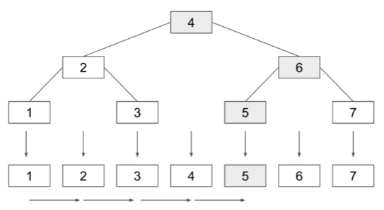
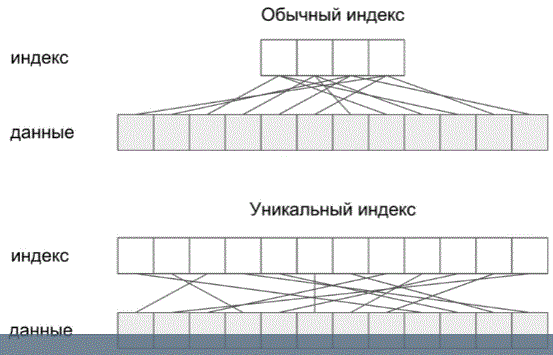
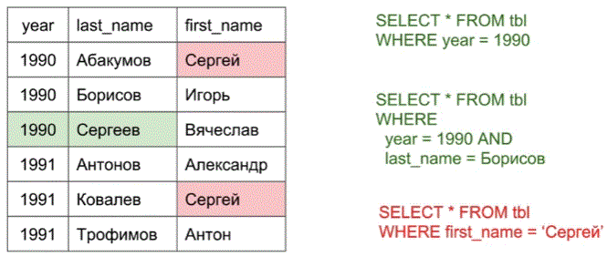

# Язык запроса SQL

## Введение в SQL

Достоинства:
* декларативный - конечный результат
* обычные предложения анг языка
* в основе - теория множеств
* архитектура может отличаться, а sql нет
* платформонезависимость
* стандарт

Недостатки:
* слабоструктурированный - 
* старый язык - завтавляет разработчика думать как машина
* плохо ложится на ООП, отсюда появляются ORM
* sql это не универсальный язык, с помощью него не получишь программу
* множество диалектов. show and describe - диалекты, а 
  info_schem - стандарт
  
Коментарии
-- - однострочный
/**/ - многострочный

sql = ddl(data definition language - язык описания данных) +
dml (data manipulation language - язык управления данными)

Скалярное выражение числа и строки
двойными кавычками не стоит увлекаться, т.к. специфич. поведение 
в postgresql.
Если имя совпадает с зарезервированным словом, то используйте обратные
кавычки

## Числовые и строковые типы данных

Столбцы в таблицах имеют тип, туда можно поместить только эти типы.

* числовые
* строковые
* null
* календарные
* коллекции (json например)

У типов есть атрибуты
* null, not null
* default - по умолчанию
* unsigned - для ключей емковсть увеличит в два раза

Числовые

Скорость обработки
tiny 0-256
`create table tbl (id INT(8))` - (8) - в консольном выводе для 
форматирования.
`insert into tbl values(5);`
`select * from tbl`
Перед 5 семь пробелов, т.к. мы указали под вывод 8 символов.
zerofill, для того чтобы пробелы были заменены на ведущие нули:
create table tbl (id INT(8) ZEROFILL)

decimal - число в виде строки, но не накапливаются ошибки, обрабатываются
значительно медленнее. Требуемая точность задается при создании:
decimal(7,4) 111.2222

Если запихнуть в тип, число не влазящае в тип, то получим ошибку.

Строковые

* Фиксированные CHAR.
* Переменные VARCHAR. Занимаемый объем зависит от длины строки.
* BLOB TINYTEXT, TEXT, MEDIUMTEXT, LONGTEXT изначально, для
  хранения бинарных данных

```sql
CREATE TABLE tbl (
name CHAR(10) DEFAULT 'anonimus',
description VARCHAR(255)
)
INSERT INTO tbl VALUES (DEFAULT, 'new user');)
SELECT
alt+x
```

На одну запись выделяется буфер в 65536 байт, для VARCHAR, поэтому
создавая несколько столбцов варчар, они поделят этот буфер.
Mysql не поддерживает кодировку, поэтому русские кодируются двумя
байтами, однако, мускл будет хранить это в 3х или 4х байтах.

Типы BLOB и TEXT еще медленнее чем VARCHAR, поскольку хранятся в
отдельной памяти, разделенной отдельно от основной таблицы. Прибегать
к тексту и блобу следует, когда не хватает варчара.

```text
DROP TABLE IF EXISTS catalogs;
CREATE TABLE catalogs (
    id INT UNSIGNED,
    name VARCHAR(255) COMMENT 'Название раздела'
) COMMENT = 'Разделы интернет магазина';

DROP TABLE IF EXISTS users (
    id INT UNSIGNED,
    name VARCHAR(255) COMMENT 'Имя покупателя'
) COMMENT = 'Покупатели';

CREATE TABLE products (
    id INT UNSIGNED,
    name VARCHAR(255) COMMENT 'Название',
    description TEXT COMMENT 'Описание',
    price DECIMAL(11,2) COMMENT 'Цена',
    catalog_id INT UNSIGNED,
) COMMENT = 'Товарные позиции';

CREATE TABLE orders (
    id INT UNSIGNED,
    user_id INT UNSIGNED,
    product_id INT UNSIGNED,
    total INT UNSIGNED DEFAULT 1 COMMENT 'Кол-во заказанных товарных позиций',
) COMMENT = 'Заказы';

-- Создадим связь товара и склада

```

## Календарные типы и множества

NULL - неизвестные значения, любая операция с неизвестным значением
- неизвестное значение. Мы можем опеределить 

ALTER TABLE tbl CHANGE id id INT UNSIGNED NOT NULL;
TRANCATE tbl; -- очистить таблицу.

Календарные типы

Есть формат календарных типов, в них mysql возвращает ответ.

* YEAR 1 байт
* DATE 3
* TIME 3
* TIMESTAMP 4
* DATETIME 8

операция сложения и вычитания - interval week

ENUM, SET

alter table tbl ADD collect JSON;
SELECT collect->>"$.first" from tbl; -- Доступ до поля first в json-объекте

JSON в разрез идеологии реляционных баз данных, так как схема данных
задается не базой, а самим JSON объектом.

```text
CREATE TABLE users (
  birthday_at DATE COMMENT 'Дата рождения',
  create_at DATETIME DEFAULT CURRENT_TIMESTAMP, -- что бы автоматически проставлялось
  updated_at DATETIME DEFAULT CURRENT_TIMESTAMP ON UPDATE CURRENT_TIMESTAMP, -- что бы автоматически проставлялось, даже когда обновляется поле.

  -- NULL - значит у интервала нет ограничений по времени, и скидка действует всегда.
)
```

## Индексы.

Чем индексы отличаются от ключей
Ключи - это столбцы при помощи которых мы добиваемся уникальности
записей и связываем записи в разных таблицах. Ключи очень часто
снабжаются индексами, поэтому в массовом сознании они сливаются в
одно понятие. Тем немение можно индексировать любой стоблец
или комбинацию.

Мы научимся позже подбирать подходящие индексы по плану выполнения
запроса.

Индексы:
* обычный (может быть несоклько)
* Уникальный индекс (может быть несколько но )
* полнотекстовый поиск - смотреть не будем, т.к. выполняется с помощью
спец баз данных.
  
Primary key - 
`id INT UNSIGNED NOT NULL PRIMARY KEY,`
`PRIMARY KEY(id) -- альтернативная запись`
создадим составной ключ по id и первым 10 символам name
`PRIMARY KEY(id, name(10))`

Как правило для первичного ключа используются целочисленные столбцы,
потому что:
* целочисленные данные обрабатываются быстрее всех.
* занимают меньший объем
* может быть снабжен автоинкрементом

0 или null или не указываем - это вызовет автоинкремент.

Псевдотип SERIAL
id SERIAL PRIMARY KEY

объявление индексов key or index, дополнительно мож
(mul - обычный индекс)

В mysql 2 типа индексов:
* BTREE

  
Поскольку значения отсортированы, то индекс хорош для поиска на
диапазоне значений или сортировке ORDERY BY.

CREATE INDEX index_of_catalog_id USING BTREE products (catalog_id);
  
* хэш хорош для поиска точного значения. В индексе хранятся хешкоды
и указатели на строки.
  
один ключ индекса может не соответствовать диапазону, а может включать
  несколько строк.
  

Индекс по нескольким столбцам:


При создании индекса по нескольким столбцам строки сортируются сначала
по year, затем по last_name, и только потом по first_name.

именно поэтому поиск по году работает эффективно, так же эффективно
работает поиск по году и фамилии, а просто по имени не работает,
потому что там нет никакой сортировки, поскольку она была нарушена
годом и фамилией.


У нас есть 
order_id 
product_id
если мы проиндексируем одним индексом, то запросы содержащие только
product_id не смогут использовать индекс
Либо ввести два индекса либо два составных индекса.

Индексы замедляют операции вставки и удаления, поэтому их следует
использовать, когда есть запросы в них нуждающиеся.

## CRUD-операции

create insert
read select
update
delete

insert into tbl (id, name) VALUES (DEFAULT, 'AA');
SELECT id, name FROM catalogs;
SELECT * from tbl; -- вывести все столбцы в порядке создания

Сделаем уникалным имя, и чтобы не раздувать индекс сделаем индекс
по первым 10 символам
`UNIQUE unique_name(name(10));`
Если вставим одинаковые значения
Нарушение целостности осуществляется с помощью ключей.

DELETE from tbl LIMIT 1; -- удалить одну запись.
Truncate - удаляет все записи и обнуляет счетчика автоинкрементов

Операция транкейт быстрее делете, потому что не читает каждую запись.

UPDATE
  tbl
SET
  name = 'процессоры (intel)'
WHERE
  id > 1;

INSERT INTO
  cat
SELECT
  *
FROM
  catalogs;


