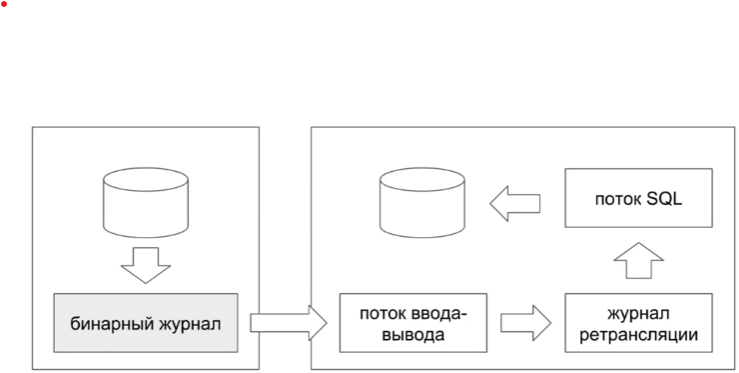

# администрирование

У сервера гибкие настройки, которые позволяют его
переконфигурировать без перекомпиляции.

mysql --verbose --help # справка
my.cnf - запишем параметры запуска.
[client] - влияет на все клиенты.

Виндовс сервисы.
В переменных mysql-сервера хранятся все настройки.
Изменение SET GLOBAL VAR.., будет установлено с но
вой сессии.

## Журнальные файлы

Журнал ошибок
Общий журнал запросов
Бинарный журнал
Журнал медленных запросов

show variables like 'error_log'
Если сервер не стартует, отсюда узнаем что не так

... 'general_log'
по умолчанию журнал отключен.
Соединения с сервеом и его запросы.

slow_query_log
по умолчанию выключен.
выявлять запросы для 
benchark(1000000000, select...) -- затормозить запрос
mysql dump slow - в человекочитаемом формате.

Логи могут писаться:
* file
* table
* none

bin_log
только те запросы, что меняют данные
изменения из резервной копии и новые из бинарного
журнала - вот что нужно для восстановления данных.

server-id - выставляем при бинарных данных, используется при
релекации.

mysql binlog


## соединения

show processlist;
kill 2; - убить соединение

# Права

Многопользовательская система

create user foo;
имя пользователся составное и состоит из имени и хоста

grant - дает права
revoke - отбирает

привилегии all, alter, create, usage,...

Уровни привилегии

от столбцов таблиц для всего.

# репликация

хранение копии одной бд на нескольких машинах

* географическое распределение
* отказоустойчивость - 
* масштабирование - вертикальное или готизонтальное.

мастер
бинарный журнал передаются на слэйв.
при классической репликации может масштабировать только операции
чтения.

## пример

Для запуске нескольких серверов на 1 хосте запустим
my.cnf
[mysqld1]
[mysqld2]

mysqld_mylti

Настройка репликации:
* Имя хоста
* порт
* Учетная запись для репликации
* пароль к учетной записи

Слейв сервер запрашивает у мастера бинарный журнал, и помещает его
в определенное пользователем место.
```
-- slave:
change master to ...
start slave;
```

slave_io_running
slave_sql_running
sql delay - чем меньше, тем актуальнее с мастером.

##

Репликация не масштабирует операции записи

С использованием репликаций нельзя масштабировать систему бесконечно.
Потому что каждый сервер обеспечивает допустим 100 000 операций
записи и чтения. А вновь включаемые должны поддержать запись и 
100 000 - запись = чтения

```text
сервера операций  insert  select
1       100 000   20 000  80 000 = 100 - 20
2       200 000   40 000  60 = 100 - 40
3       300 000   80 000 


```
20% вставки, репликация поддерживает только чтение, поэтому вставка
должна выполниться на каждом сервере.

Еще одна проблема репликации - все данные должны помещаться на одной
машине. Можно дробить данные - секционирование, или шардирование.

Задержка распространения

## Топологии

* горячий резерв
* мастер мастер

В мастер мастер, при вставке могут возникать конфликты, из-за одинаковых
автоинкрементов, поэтому выставив разные офсеты, например, первый
четные числа, а второй нечетные, решат проблему.
