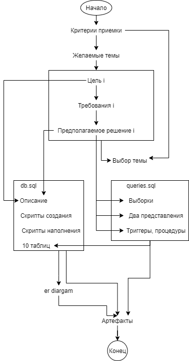

# Roadmap

1. Критерии приемки
2. Желаемые темы
3. Цель i
4. Требования i
5. Предполагаемое решение i
6. Выбор темы
7. Переписываем предполагаемое решение в queries.sql
8. Из queries.sql выписываем таблицы и имена их столбцов
9. ER-диаграмма
10. Артефакты
